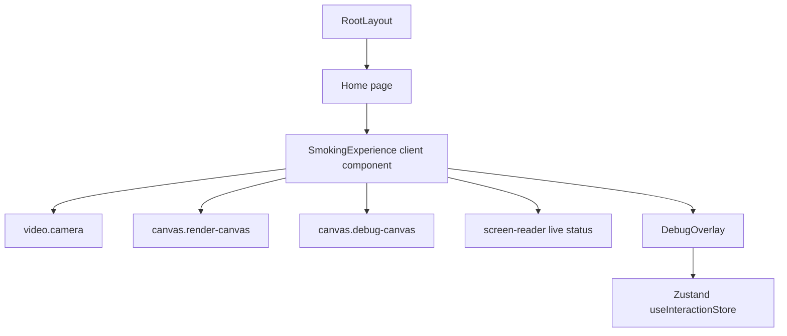
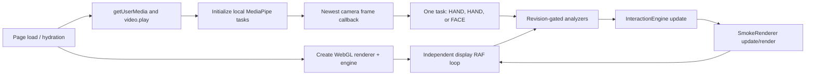
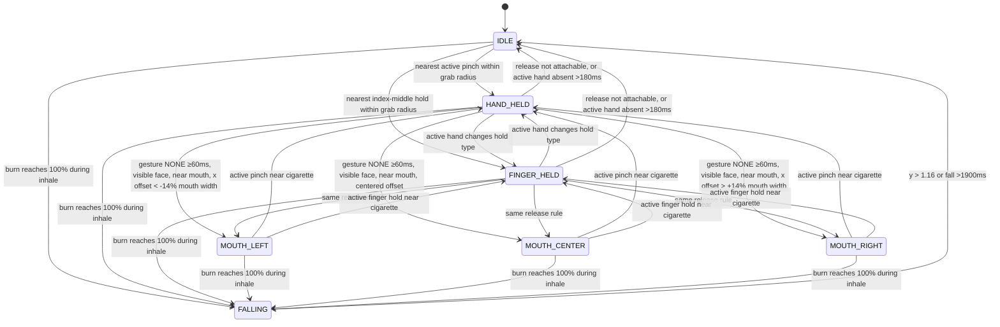
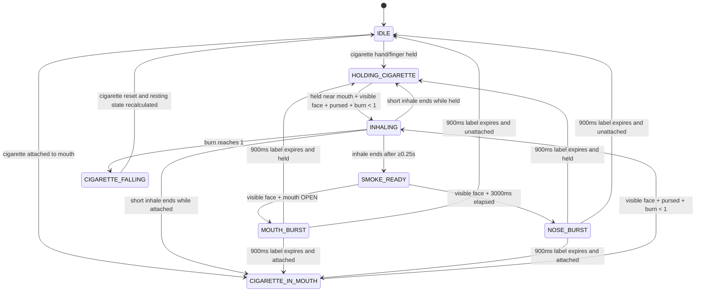
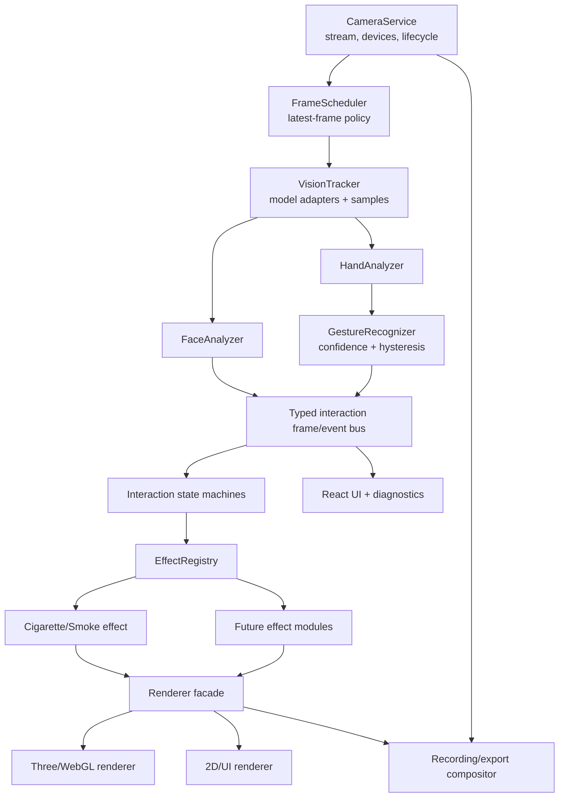

# Current Architecture Audit

Audit scope: branch `dev`, repository state inspected on 2026-09-07. This is a behavior-preserving, source-level audit. No application source, dependency, shader, MediaPipe setting, gesture threshold, or runtime behavior was changed.

## 1. Executive summary

Virtual Smoke is a compact, browser-only AR experience built as a Vinext/React application. One client component (`SmokingExperience`) owns almost the entire runtime: webcam acquisition, MediaPipe startup and scheduling, landmark analysis, the two interaction state machines, Three.js rendering, diagnostics, keyboard handling, resize handling, and cleanup. The browser camera is shown as a mirrored, full-viewport `object-fit: cover` video. Landmark X coordinates are mirrored in analysis, and both the WebGL and debug layers repeat the video's cover-crop mapping, keeping all three layers aligned.

The real-time pipeline deliberately runs only one MediaPipe task per newest camera frame in a `HAND, HAND, FACE` cycle. This gives hand manipulation twice the inference cadence of face analysis, avoids running two synchronous model calls on every camera frame, prevents inference overlap and queued stale work, and leaves the display render loop independent of camera/inference cadence.

The interaction logic is split into face/hand analyzers and a single `InteractionEngine`, but the experience remains tightly coupled around cigarette-specific assumptions. The renderer likewise combines cigarette construction, masking, particle simulation, adaptive quality, shaders, coordinate mapping, and diagnostics in one class. This is workable for the current effect, but future effects would be difficult to add without duplicated scheduling, gesture logic, particle behavior, and state transitions.

The repository also contains deployment/database starter scaffolding that is not used by the AR interaction itself: Cloudflare Worker image optimization, optional D1/Drizzle files, an example notes API, placeholder public SVGs, and OpenAI Sites hosting configuration. These should not be removed during this audit. The build and tests depend on some of the deployment scaffolding even though the interactive experience does not.

## 2. Repository structure

```text
Virtual_Smoke/
├── app/
│   ├── layout.tsx                 # root HTML shell and shared metadata
│   ├── page.tsx                   # `/` route; renders SmokingExperience
│   ├── smoking-experience.tsx     # client runtime owner and React composition
│   ├── debug-overlay.tsx          # Zustand-driven metrics panel and 2D landmarks
│   ├── globals.css                # viewport layers, mirror, visibility, debug UI
│   ├── chatgpt-auth.ts            # currently not imported by the AR path
│   └── lib/
│       ├── analyzers.ts           # face and hand feature extraction
│       ├── interaction-engine.ts  # cigarette and smoking state machines
│       ├── math.ts                # normalized-coordinate math and smoothing
│       ├── smoke-renderer.ts      # Three.js cigarette, mask, particles, GLSL
│       ├── store.ts               # Zustand debug/diagnostic state only
│       ├── types.ts               # tracking, analysis, state, emission contracts
│       └── vision-tracker.ts      # MediaPipe creation and alternating inference
├── public/
│   ├── mediapipe/models/          # local face and hand `.task` models
│   ├── mediapipe/wasm/            # local SIMD/non-SIMD Tasks Vision runtime
│   ├── og.png, favicon.svg        # active metadata assets
│   └── file.svg, globe.svg,
│       window.svg                 # likely starter assets; no app imports found
├── tests/rendered-html.test.mjs   # build shell, asset, source invariant, engine tests
├── worker/index.ts                # Vinext/Cloudflare request + image optimization entry
├── db/                            # optional empty D1/Drizzle integration
├── drizzle/meta/                  # generated migration journal scaffolding
├── examples/d1/                   # opt-in notes API/database example
├── .openai/hosting.json           # Sites binding configuration; D1/R2 are null
├── vite.config.ts                 # Vinext, Sites, and Cloudflare Vite plugins
├── package.json                   # scripts and direct dependencies
├── next.config.ts                 # empty Next-compatible configuration
├── eslint.config.mjs              # lint configuration
├── tsconfig.json                  # app type-checking scope
└── README.md, prd.md, LICENSE     # project documentation/license
```

`.next/`, `.vinext/`, `.wrangler/`, `node_modules/`, and build output such as `dist/` are generated/local artifacts, not authored runtime architecture.

### React component hierarchy



`RootLayout` supplies `<html>`/`<body>` and global CSS. `Home` has no business logic; it returns `SmokingExperience`. `SmokingExperience` renders only native layers plus `DebugOverlay`. Three.js renders imperatively into the render canvas, while tracking debug graphics render imperatively into the debug canvas.

## 3. Runtime flow

### Page load to active AR interaction

1. Vinext serves the app-router route. `app/layout.tsx` creates the document shell and `app/page.tsx` renders `SmokingExperience`.
2. React hydrates `SmokingExperience`. Its initial camera state is `loading`; the video is present but transparent. Three refs identify the video, render canvas, and debug canvas.
3. A mount-only `useEffect` installs the `D` key handler and window resize handler.
4. WebGL starts immediately, before permission or tracking. `SmokeRenderer` creates the renderer, scene, orthographic camera, cigarette geometry, mouth mask, fixed particle buffers, shaders, GPU diagnostics, and initial cover mapping. This keeps the cigarette visible even while camera permission/models are pending or tracking fails.
5. `InteractionEngine` is created with a renderer emission callback. The independent display `requestAnimationFrame` loop starts.
6. In parallel, `startCameraAndTracking()` calls `getUserMedia`, assigns the returned stream to `video.srcObject`, awaits `video.play()`, marks the camera `ready`, and recalculates sizing.
7. `VisionTracker.initialize()` resolves the local WASM files and creates face and hand tasks on GPU. If GPU creation throws, it closes partial tasks and recreates both on CPU.
8. Once tracking is ready, camera-frame scheduling begins. `requestVideoFrameCallback` is preferred; a display `requestAnimationFrame` recursion is the fallback.
9. Each accepted new camera frame calls exactly one synchronous MediaPipe inference task. The newest combined cached result becomes `latestTracking`.
10. The display loop applies a hand or face result only when that task's revision changes. It analyzes landmarks, updates `InteractionEngine`, updates `SmokeRenderer`, optionally draws landmarks, samples performance metrics, and schedules the next display frame.
11. Interaction flows from normalized mirrored landmarks → analyzed face/hands → cigarette/smoking snapshot → cigarette transform, masking, ember state, smoke emission, and GPU rendering.



### Render loop

The display loop runs on `requestAnimationFrame`. Frame time is `now - lastFrameAt`; simulation `dt` is clamped to 0.001–0.05 seconds, limiting large physics or burn jumps. It retains the latest 240 frame times. Tracking results are not awaited by this loop: it consumes a new `latestTracking` object once and keeps the last analyzed values otherwise. Hand and face revisions prevent re-analysis of the cached half of an alternating result. Input latency is refreshed only when a newly applied result was a hand result.

### Cleanup lifecycle

The effect cleanup sets `running = false`, removes keyboard/resize listeners, cancels the display RAF, cancels the video-frame callback or fallback RAF, closes both MediaPipe tasks, disposes Three.js renderer/particle and mesh resources, and stops every media stream track. The `running` checks also stop a late camera stream or close a tracker that completes after unmount.

### Zustand usage

`useInteractionStore` is a global diagnostics/UI store, not the authoritative simulation state. `InteractionEngine.snapshot`, analyzer instances, and tracker caches are imperative class/local state. The store contains debug visibility, tracking and interaction labels, ratios, counters, timings, delegate/context/WebGL/GPU data, and particle quality. `DebugOverlay` subscribes to the full store. Imperative code uses `getState()` to toggle with `D` and to publish patches. Interaction diagnostics are throttled to 80 ms and only written in debug mode; particle metrics are throttled to 250 ms; half-second performance windows are likewise published only when debug is active. Initialization diagnostics are published regardless of debug mode.

## 4. Camera architecture

### Acquisition and requested constraints

`navigator.mediaDevices.getUserMedia` requests:

```ts
{
  audio: false,
  video: {
    width: { ideal: 1280 },
    height: { ideal: 720 },
    frameRate: { ideal: 60, min: 30 },
    facingMode: "user"
  }
}
```

These are constraints, not guarantees. Actual dimensions come from `video.videoWidth`/`video.videoHeight`; the sizing fallback before metadata is 1920×1080. No exact device selection or post-acquisition `getSettings()` validation occurs.

The stream is assigned to a muted, autoplay, `playsInline` `<video>`. A rejected acquisition/play path sets `cameraState = denied`; renderer operation continues, but MediaPipe is not initialized. Successful playback sets `ready`, causing a 300 ms CSS fade-in (disabled for reduced motion).

### Mirroring, scheduling, and stale-frame prevention

CSS mirrors only the visible video with `transform: scaleX(-1)`. Analysis mirrors every consumed landmark with `x = 1 - x`, so overlay/interaction coordinates match the presentation. Z is preserved. Full debug landmark arrays are only mirrored and retained while debug mode is enabled.

`video.requestVideoFrameCallback` is preferred. The source timestamp is selected as `metadata.captureTime`, then `metadata.presentationTime`, then callback `now`. If the API is absent, a recursive RAF supplies its timestamp. Each callback schedules the next callback after processing. `VisionTracker` rejects frames when tasks are unavailable, video readiness is below `HAVE_CURRENT_DATA`, inference is already active, or `video.currentTime` equals the last processed time. Therefore the fallback cannot repeatedly infer the same decoded frame.

The timestamp passed to `detectForVideo` is a fresh monotonic `performance.now()` value, which avoids non-monotonic media/capture timestamps. The original source timestamp is retained for latency only if it is finite, not in the future, and less than 1000 ms old at completion; otherwise inference start time is substituted. `try/finally` always clears the `inferenceInFlight` guard. Exceptions discard that frame without overwriting the last good result.

### Resize, cover crop, and alignment

The window `resize` handler calls `SmokeRenderer.resize(viewportWidth, viewportHeight, actualVideoWidth, actualVideoHeight)`. A successful `video.play()` also triggers it. The video uses `object-fit: cover`. The renderer duplicates that crop:

- If viewport aspect is wider than video aspect: displayed width = viewport width; displayed height = width / video aspect; vertical crop is half the overflow.
- Otherwise: displayed height = viewport height; displayed width = height × video aspect; horizontal crop is half the overflow.
- A normalized point maps to `((x × displayedWidth - cropX) / viewportWidth, (y × displayedHeight - cropY) / viewportHeight)` for WebGL.
- A normalized X length maps to `length × displayedWidth / viewportWidth`.
- The debug canvas uses the same cover calculation in pixels: `(x × displayedWidth - cropX, y × displayedHeight - cropY)`.

The orthographic camera is defined as left 0, right 1, top 0, bottom 1, creating deliberate Y-down screen coordinates matching MediaPipe. Because that reverses normal triangle winding, cigarette and mask mesh materials are forced to `DoubleSide`. The render/debug canvases fill the same viewport as the video. Canvas drawing-buffer size is managed by Three.js; the 2D debug canvas uses CSS-pixel width/height and therefore does not explicitly scale for device pixel ratio.

Potential alignment limitations: resize is window-driven rather than `ResizeObserver`-driven; no `loadedmetadata` or video-resolution-change listener exists beyond the post-`play()` resize; orientation/video setting changes without a window resize could leave stale crop values.

## 5. Vision architecture

### Initialization

`FilesetResolver.forVisionTasks("/mediapipe/wasm")` loads the checked-in Tasks Vision WASM/JS runtime. Model assets are also local:

- Face: `/mediapipe/models/face_landmarker.task`
- Hand: `/mediapipe/models/hand_landmarker.task`

Both tasks use `runningMode: "VIDEO"`. GPU initialization gives each task a separate detached 640×360 canvas and passes it through the task options. Tasks are created concurrently with `Promise.all`. On any GPU setup failure, partial face/hand tasks are closed and both are recreated with CPU delegate and without task canvases. Diagnostics identify each GPU canvas context as WebGL2, WebGL1, or none.

Face task configuration:

- delegate: GPU initially, CPU fallback
- `numFaces: 1`
- face detection confidence: 0.58
- face presence confidence: 0.58
- tracking confidence: 0.55
- blendshapes: disabled
- facial transformation matrices: disabled

Hand task configuration:

- delegate: GPU initially, CPU fallback
- `numHands: 1`
- hand detection confidence: 0.52
- hand presence confidence: 0.52
- tracking confidence: 0.50

The optional face heads are disabled because the application derives mouth expression and pose from landmarks and does not consume their outputs.

### Inference schedule and concurrency

The repeating schedule is `HAND → HAND → FACE`; `scheduleIndex === 2` selects face, all other positions select hand. Only the selected task calls `detectForVideo` for a camera frame. The other task's latest landmarks and revision remain cached in the returned `TrackingFrame`.

This choice gives hand input—the grab/release critical path—approximately two-thirds of accepted inference slots and face input one-third. Running both models every frame would roughly double synchronous inference work, increase main-thread/GPU contention, reduce throughput, and increase the risk that results describe old camera frames. Alternation preserves newest-frame semantics and display responsiveness. It trades lower face temporal resolution for lower hand latency and steadier rendering.

Although current calls are synchronous, `inferenceInFlight` explicitly protects against re-entry. `lastVideoTime` rejects duplicate decoded frames. Separate `handRevision` and `faceRevision` counters ensure the React-side loop analyzes only the model actually refreshed. The last valid result from the other task remains usable between its inference turns.

## 6. Face analysis

MediaPipe provides normalized coordinates with an unmirrored camera X axis. Every landmark below is mirrored before use. `distance()` scales Y differences by 9/16, an implicit 16:9 metric correction; X is unchanged and Z is ignored for these measurements.

| Index | Anatomical role | Consumption |
|---:|---|---|
| 10 | upper forehead / face top | smoothed `forehead`; face center, face height, idle anchor |
| 152 | chin | smoothed `chin`; face center, face height, idle anchor |
| 234 | subject's left face edge before mirroring | becomes screen-right edge after mirrored index swap; face width |
| 454 | subject's right face edge before mirroring | becomes screen-left edge after mirrored index swap; face width |
| 61 | left mouth corner before mirroring | becomes screen-right `mouthRight`; width, roll, right anchor |
| 291 | right mouth corner before mirroring | becomes screen-left `mouthLeft`; width, roll, left anchor |
| 13 | upper inner/central lip | mouth midpoint and opening height |
| 14 | lower inner/central lip | mouth midpoint and opening height |
| 98 | one nostril | sorted by mirrored X into `noseLeft`/`noseRight`; nose burst |
| 327 | opposite nostril | sorted by mirrored X into `noseLeft`/`noseRight`; nose burst |

When debug mode is on, all available landmarks are also copied and every second face point is drawn; those extra points are visualization-only.

### Calculations and thresholds

- Face center: midpoint of landmark 10 and 152.
- Face width: corrected 2D distance between mirrored face edges, clamped to at least 0.001.
- Face height: corrected 2D distance between forehead and chin, clamped to at least 0.001.
- Mouth center: midpoint of landmarks 13 and 14, not the corner midpoint.
- Mouth width: corrected corner-to-corner distance, clamped to at least 0.001.
- Mouth open ratio: lip vertical distance / raw mouth width.
- Mouth width ratio: raw mouth width / raw face width.
- Pursed lips: `mouthWidthRatio <= 0.31`. This has no hysteresis of its own.
- Mouth state: pursed always forces `CLOSED`; otherwise `OPEN` begins at open ratio ≥ 0.075 and remains open down to ≥ 0.060. This 0.015 hysteresis prevents chatter around a single threshold.
- Nose positions: the mirrored 98/327 points are sorted by screen X rather than assumed anatomical label.
- Yaw: `clamp(((mouthCenter.x - faceCenter.x) / faceWidth) × 135, -60, 60)` degrees. This is a heuristic horizontal mouth-to-face-center displacement, not a transformation-matrix pose estimate.
- Roll: `atan2(mouthRight.y - mouthLeft.y, mouthRight.x - mouthLeft.x)` radians.

Scalar mouth width, mouth width ratio, and mouth open ratio use exponential smoothing `1 - exp(-dt × 30)`. Center, forehead, chin, mouth anchors, and nostrils use that same factor. Yaw, roll, `mouthPursed`, and `mouthState` are calculated from current measurements (mouth classification uses smoothed mouth ratios); yaw/roll themselves are not smoothed fields.

A face result is accepted only with at least 468 landmarks. When missing, the last analysis is returned with `visible = false`. `inGracePeriod` remains true for 1000 ms after the last valid face, and retained debug landmarks are cleared only after that grace period. Face-attached cigarette positioning and mouth masking honor visible-or-grace, but new inhale/exhale detection requires `face.visible`.

Default no-face geometry exists around center (0.5, 0.42), primarily allowing initial layout. Initial face width is 0.24, face height 0.22, mouth width 0.08, mouth width ratio 0.333, and mouth state closed.

## 7. Hand analysis

All used coordinates are mirrored first and measured with the same 9/16 Y correction.

| Index | Landmark | Consumption |
|---:|---|---|
| 0 | wrist | palm-size scale; extension tests |
| 4 | thumb tip | pinch distance; pinch grip midpoint |
| 5 | index MCP | palm width candidate |
| 6 | index PIP | index extension test |
| 8 | index tip | pinch, extension, separation, rotation, grip |
| 9 | middle MCP | wrist-to-palm-length candidate |
| 10 | middle PIP | middle extension test |
| 12 | middle tip | extension, separation, rotation, finger grip |
| 17 | pinky MCP | palm width candidate |

Palm size is `max(distance(wrist, middleMcp), distance(indexMcp, pinkyMcp), 0.001)`. All gesture distances are normalized by this value, making thresholds less sensitive to hand depth/scale.

- Pinch distance: `distance(thumbTip, indexTip) / palmSize`.
- Pinch: pinch distance < 0.29.
- Index extended: wrist-to-index-tip distance > wrist-to-index-PIP distance × 1.12.
- Middle extended: wrist-to-middle-tip distance > wrist-to-middle-PIP distance × 1.10.
- Finger separation: index-tip to middle-tip distance / palm size.
- Index-middle hold: both fingers extended and separation > 0.12 and < 0.52.
- Gesture priority: pinch wins; otherwise index-middle hold; otherwise none.
- Grip point: midpoint of thumb/index tips for pinch and none; midpoint of index/middle tips for index-middle hold.
- Cigarette rotation while held: angle from index tip to middle tip minus π/2, exponentially smoothed with response 24.

MediaPipe handedness category names are used only to construct the persistent-in-frame ID `${categoryName}-${resultIndex}`. Because only one hand is tracked, the engine selects at most one active hand. No handedness-specific gesture geometry is applied. The presentation is mirrored but handedness labels are not swapped. Full 21-point arrays are retained only for debug drawing.

There is no analyzer-level gesture smoothing or hysteresis. Temporal release/loss timers in `InteractionEngine` absorb short state dropouts.

## 8. Cigarette state machine



The `IDLE → FALLING` edge is structurally possible only if burn had already accumulated in a prior state and state changed to idle before a subsequent qualifying inhale; under normal behavior inhale requires held-near-mouth or mouth attachment, so depletion usually originates from a held/mouth state.

### Positioning, transitions, and constants

- Initial normalized position: (0.5, 0.7); rotation −0.12 rad; base/current length 0.07.
- Base length target: `clamp(faceWidth × 0.275, 0.0475, 0.1025)`, response 18. It continues using the analyzer's retained/default face width.
- Visible remaining length ratio: linear from 1.0 to 0.28 as burn goes 0→1.
- Idle anchoring: while `anchoredToFace` and face is visible/in grace, target X is face center; Y is `clamp(chin.y + faceHeight × 0.48, 0.58, 0.84)`. Position response is 7; rotation target is face roll −0.1 with response 6.
- Idle grab: choose the closest non-`NONE` hand. Grab radius is `max(0.035, baseLength × 0.54)` and comparison is strict `<`. A pinch yields `HAND_HELD`; index-middle yields `FINGER_HELD`.
- Held following: grip position response 32. Rotation response 24. The state can switch between held types immediately as the active gesture changes.
- Explicit release: active hand still exists but gesture is `NONE` continuously for at least 60 ms. This is the only release path allowed to attach to the mouth.
- Hand loss: no hand with the active ID for more than 180 ms causes release directly to `IDLE`, never mouth attachment. The last cigarette transform is held during the grace.
- Mouth attach distance: cigarette-to-mouth-center `< max(mouthWidth × 0.90, baseLength × 0.72)`, with a currently visible face. Horizontal offset less than `−mouthWidth × 0.14` chooses left, greater than `+mouthWidth × 0.14` chooses right, otherwise center.
- Mouth anchoring: left/right/center uses the matching mouth point. Left and center angle = face roll; right angle = face roll + π. An outward vector is `(-cos(angle), -sin(angle))`, and the center target is anchor + outward × current length × 0.48. Position response 28; rotation response 26. Face grace keeps it anchored through a short tracking loss.
- Mouth re-grab: the first non-none hand within `< max(0.035, baseLength × 0.60)` switches to its corresponding held state and clears mouth side.
- Offscreen reset: outside X or Y [−0.08, 1.08] continuously for 1500 ms resets directly to idle. Re-entry clears the timer.
- Falling: starts only at full burn. Initial X velocity is random in [−0.04, +0.04), initial Y velocity is −0.12; Y acceleration is +0.72/s² and rotation advances 5.2 rad/s. It resets when Y > 1.16 or after 1900 ms.
- Reset: state idle, mouth side null, burn zero, visible length restored, position/rotation restored relative to visible face or defaults, falling values cleared, and face anchoring re-enabled.

`dt` is capped at 0.05 seconds both by the experience and engine. `releaseStartedAt`, `handLostAt`, and `offscreenStartedAt` use zero as an unset sentinel. Position and rotation smoothing are frame-rate independent exponential responses.

## 9. Smoking state machine

The smoking state is a presentation/interaction label derived from inhale, pending smoke, effect-label timers, and cigarette state. It is not completely independent of the cigarette machine.



### Detection and burn

Held-near-mouth means `HAND_HELD` or `FINGER_HELD` and cigarette-to-mouth-center distance `<= max(mouthWidth × 1.25, baseLength × 0.90)`. Inhale requires a currently visible face, either mouth attachment or held-near-mouth, `mouthPursed`, and burn < 1. Starting inhale clears prior smoke readiness and ready timestamp, then resets inhale duration to zero. Each update adds clamped `dt` to inhale duration and `dt / 9.8` to burn (`FULL_BURN_SECONDS = 7 × 1.4 = 9.8`). The visible cigarette shortens linearly to 28% of its base length.

When inhale conditions cease, `finishInhale` runs. At least 0.25 seconds makes smoke ready, records the ready timestamp, and computes one-shot strength as `clamp(inhaleSeconds / 1.4, 0.45, 1.35)`. A shorter inhale produces no pending smoke. The last `snapshot.inhaleSeconds` remains visible after completion.

### Exhale and depletion

While smoke is ready, a currently visible open mouth wins and immediately emits one `MOUTH_BURST`. Its origin is the mouth center. Direction is normalized from `(sin(yawRadians) × 0.4, −0.25, 1)`. If the mouth does not open and 3000 ms elapse, a visible face triggers a `NOSE_BURST` from both nostrils with direction (0, −1, 0). Both consume readiness immediately, so remaining open or waiting cannot repeat the batch. Their state label persists for 900 ms, after which the current cigarette relationship determines the resting state.

At burn 1, `startFalling` calls `finishInhale`, marks the cigarette falling, sets smoking state `CIGARETTE_FALLING`, clears attachment/active hand, and starts physics. A nuance worth preserving/clarifying later: `finishInhale` at depletion may set `smokeReady`; cigarette reset does not explicitly clear smoke-readiness, pending strength, inhale-active duration, or smoking state. Subsequent normal updates reconcile most labels, but these fields are more weakly encapsulated than the diagram suggests.

## 10. Renderer architecture

### Scene and camera

`SmokeRenderer` owns one transparent Three.js `WebGLRenderer`, a `Scene`, and an `OrthographicCamera(0, 1, 0, 1, 0.1, 10)` positioned at Z=2 looking at the origin. Renderer options are alpha, no antialiasing, high-performance power preference, highp precision, and `premultipliedAlpha: false`. Clear color is transparent black. Pixel ratio is capped at 1.5.

### Cigarette and masking

The cigarette is a group of simple 2.5D meshes:

- dark outline plane, 1.055×0.135, opacity 0.68
- offset black shadow plane, 1.02×0.11, opacity 0.38
- ash plane, 0.075×0.095
- paper plane, 0.67×0.095
- paper shade plane, 0.67×0.025, opacity 0.55
- filter plane, 0.255×0.10
- filter band plane, 0.018×0.102
- ember circle, radius 0.057, 18 segments
- additive glow circle, radius 0.11, 24 segments, opacity 0.28

The group sits at Z=0.08, render order 0, and is never frustum culled. All mesh materials are forced double-sided. Position and length are mapped from video coordinates every render. Group Y scale is `mappedBaseLength × viewportWidth/viewportHeight × 1.15`, preserving visible thickness under screen-space aspect.

Ember color switches from dark gray to orange while `smokingState === INHALING`; ember and glow scales flicker via two sine terms, and glow opacity rises from 0.025 to 0.34 while burning.

The lip mask is a 28-segment circle using a material with color writes disabled and depth writes/tests enabled. It appears only while attached to a mouth and face is visible/in grace. It maps to mouth center/roll and scales from mouth width. At Z=0.22 and render order 1, its depth occludes the portion of the cigarette intended to appear behind the lips without drawing color.

### Particle system

The fixed maximum is 8,000 points. `BufferGeometry` has a conventional zero-filled `position` attribute solely to establish point count plus custom typed-array attributes:

- `aStart`: vec3 origin
- `aVelocity`: vec3 initial velocity
- `aSpawnTime`: seconds
- `aLifetime`: seconds
- `aSize`: base point size
- `aSeed`: random shape/motion seed
- `aKind`: 0 tip, 1 mouth, 2 nose

Draw range is always all 8,000. A ring cursor overwrites the oldest slot; shader age/lifetime makes unused or expired points invisible. Every emission marks all seven custom attributes dirty, causing complete attribute buffer uploads. Points sit at Z=0.32, render order 2, with frustum culling disabled.

Emitter types:

- Tip/base smoke (`kind 0`): only while inhaling. Accumulator rate is 60 particles/s × quality factor. Lifetime 4–6 s; size 18–33; small origin/velocity jitter and upward velocity.
- Mouth burst (`kind 1`): count `max(600, round((280 + strength × 120) × 5 × qualityFactor))`; layered origins, broad lateral spread, upward velocity; lifetime 2.7–4.2 s; size 20–62.
- Nose burst (`kind 2`): per nostril `max(200, round((70 + strength × 24) × 5 × qualityFactor))`; outward/upward velocities; lifetime 2.3–3.5 s; size 14–39.

The constants impose a global smoke volume multiplier of 5. Particle spawn Z is 0.3. Motion and expiry are entirely shader-driven; JavaScript does not iterate particles per frame.

### Mapping, order, transparency, and disposal

Renderer crop mapping duplicates CSS `cover` as described in Camera Architecture. Render order is cigarette 0, invisible depth-writing lip mask 1, smoke points 2. Smoke `ShaderMaterial` is transparent, normal blended, depth writes off, and depth tests off; it therefore visually overlays prior geometry and the mask does not occlude smoke. Cigarette glow uses additive blending; other cigarette transparency uses normal material defaults. The transparent canvas overlays the mirrored video.

`dispose()` releases the WebGL renderer, particle geometry/material, and every mesh geometry/material in the scene. The particle `Points` object is not a mesh, so its already-explicit resources avoid double-disposal.

## 11. GLSL architecture

### Vertex stage

The vertex shader derives `age = uTime - spawnTime` and normalized `lifeT = clamp(age/lifetime, 0, 1)`. `alive` is one only between spawn and lifetime. Base ballistic position is start + velocity × age. Two seed-dependent sine/cosine terms create curl and cross-curl. `aKind` is interpreted through steps: kinds ≥1 are mouth/nose exhale smoke, and kinds ≥2 are nose smoke. Those flags increase lateral curl, vertical cross-curl, and quadratic upward drift. (In the renderer's Y-down coordinate system, subtracting Y moves upward.)

Model-view/projection transforms produce clip position. Point size grows from 0.72× to 3.45× the per-particle size using a smoothstep over the first 78% of life, multiplied by capped device pixel ratio and `alive`. Alpha fades in over the first 5% of life, then fades from 48% to 100% of life.

### Fragment stage

Each point sprite maps `gl_PointCoord` to −1…1, rotates it by its seed, and randomly stretches X. A hash feeds interpolated value noise. Three-octave FBM rotates/scales the coordinate each octave and halves amplitude. Broad and fine FBM perturb the radial boundary, breaking the circular edge into cloudy wisps. A smooth envelope fades the perturbed radius from 0.32 to 1.03; a second noise mix modulates internal opacity.

Base opacity is 0.068 for tip smoke, 0.055 for mouth/nose smoke, with +0.007 for nose smoke. The lifetime alpha, envelope, wisps, and type opacity multiply together. Smoke color is neutral gray `vec3(0.4117647)`. Fragments below alpha 0.0015 are discarded. The resulting straight-alpha output is composited with Three.js normal blending over a renderer configured with non-premultiplied alpha.

The shader provides visual turbulence, not fluid simulation: velocity never changes after spawn, curl is analytic, and particles do not interact with hands, one another, or scene geometry.

## 12. Performance architecture

### Instrumentation

- FPS: counts display RAF frames and updates every ≥500 ms as frames × 1000 / window duration.
- Frame history: last 240 raw frame intervals.
- Worst frame: maximum in that rolling history.
- P95: sorted history at `floor(length × 0.95)`, capped to final index. This is a nearest-rank-like sample, not an interpolated percentile.
- Input latency: `performance.now() - sourceTimestamp`, updated only when a newly applied tracking frame's updated task is `HAND`.
- Hand/face inference: synchronous `detectForVideo` wall time measured independently and retained until that task next runs.
- GPU diagnostics: renderer/vendor from `WEBGL_debug_renderer_info` when allowed, otherwise standard masked strings. Hardware acceleration is inferred false only when renderer matches SwiftShader, llvmpipe, or software rasterizer.
- WebGL diagnostics: WebGL2 vs WebGL1, max texture size (returned internally but not published in the store/UI), and separate face/hand task canvas context kind.
- Dataset diagnostics: tracking schedule/delegate/context, WebGL/GPU, FPS, worst, p95, input latency, and inference timings are exposed on the render canvas.
- Debug mode: `D` toggles. It enables the overlay, full landmark retention/drawing, engine store updates, and particle diagnostics. Turning it off clears the debug canvas.

### Adaptive quality

Particle quality starts high. Quality factors are high 1.0, medium 0.72, low 0.48 and affect emission counts/rate, not the 8,000-point draw range. FPS <42 accumulates low-FPS time and resets recovery; after >1.5 s, quality drops one step and the low timer resets. FPS >54 accumulates recovery and decays low time by 0.5×dt; after >4 s, quality rises one step and recovery resets. FPS in 42–54 changes neither timer, so accumulated recovery can survive a neutral period. Quality is published to Zustand only when debug mode is active.

### Likely bottlenecks

1. MediaPipe `detectForVideo` is synchronous on the main thread. Alternation reduces but does not eliminate visible stalls, especially on CPU fallback.
2. Burst emitters can write hundreds to thousands of particles in one JavaScript turn. With strength 1.35 at high quality, mouth count is about 2,210; nose count about 1,024 total.
3. Every batch marks every particle attribute dirty, uploading seven full 8,000-element buffers rather than updated ranges. Multiple tip-spawn updates can therefore create frequent full GPU buffer traffic.
4. The shader draws all 8,000 slots every frame even if most particles are dead; fragment FBM evaluates six value-noise calls across two three-octave FBMs per surviving fragment, plus edge overdraw from large translucent point sprites.
5. Transparent normal blending and large growing sprites can be fill-rate heavy on mobile/high-DPI displays, although pixel ratio is capped at 1.5.
6. Debug mode copies/maps all face and hand landmarks, sorts frame histories, draws 2D points, and makes React/Zustand updates. It intentionally adds overhead and should not be used as a production baseline.
7. `DebugOverlay` subscribes to the whole store, so any diagnostic patch rerenders the complete panel.
8. Performance metrics themselves do not separate CPU render-loop time, GPU time, camera decode, callback delay, analyzer time, emission/upload time, or React debug cost. “Input latency” is hand-only and may use presentation or inference timestamps when capture time is unavailable.

## 13. Dependency classification

Classification covers every direct dependency declared in `package.json`; transitive packages in `package-lock.json` inherit the purpose of their direct parent and are not individually application architecture choices.

| Dependency | Class | Current role |
|---|---|---|
| `react` | A. Core runtime | component model, hooks, hydration |
| `react-dom` | A. Core runtime | DOM rendering/hydration through Vinext |
| `three` | A. Core runtime | WebGL scene, cigarette meshes, particle buffers/shaders |
| `@mediapipe/tasks-vision` | A. Core runtime | face/hand landmark inference and WASM task runtime |
| `zustand` | A. Core runtime | debug/diagnostic UI state; not core simulation state, but imported in production path |
| `vinext` | A/B. Runtime framework and build tooling | dev/build/start commands, app-router server entry, production worker path |
| `vite` | B. Build/development tooling | build/dev orchestration beneath Vinext |
| `@vitejs/plugin-react` | B. Build/development tooling | React transform/tooling dependency |
| `@vitejs/plugin-rsc` | B. Build/development tooling | React Server Components build support |
| `react-server-dom-webpack` | B/A. Framework runtime support | RSC transport expected by the Vinext stack; no direct app import |
| `typescript` | B. Build/development tooling | type checking/transpilation inputs |
| `@types/node` | B. Build/development tooling | Node/build/test types |
| `@types/react` | B. Build/development tooling | React types |
| `@types/react-dom` | B. Build/development tooling | React DOM types |
| `@types/three` | B. Build/development tooling | Three.js types |
| `eslint` | B. Build/development tooling | lint runner |
| `@eslint/js` | B. Build/development tooling | base ESLint rules |
| `typescript-eslint` | B. Build/development tooling | TypeScript lint parsing/rules |
| `eslint-plugin-react` | B. Build/development tooling | React lint rules |
| `eslint-plugin-react-hooks` | B. Build/development tooling | hooks lint rules |
| `eslint-plugin-jsx-a11y` | B. Build/development tooling | JSX accessibility lint rules |
| `@next/eslint-plugin-next` | B. Build/development tooling | Next/app-router-oriented lint rules |
| `globals` | B. Build/development tooling | browser/Node/service-worker lint globals |
| `tailwindcss` | B/A. Styling build dependency | `@import "tailwindcss"`; authored CSS otherwise uses plain selectors |
| `@tailwindcss/postcss` | B. Build/development tooling | PostCSS Tailwind integration |
| `@cloudflare/vite-plugin` | B/C. Deployment tooling | Cloudflare Vite environment and local worker bindings; not AR logic |
| `wrangler` | B/C. Deployment tooling | Cloudflare local/deploy state/toolchain; not directly scripted here |
| `@openai/sites-vite-plugin` | B/C. Hosting tooling | OpenAI Sites integration and hosting configuration |
| `drizzle-orm` | C/D. Optional or leftover scaffolding | only `db/` and example imports; no active AR/app route uses database |
| `drizzle-kit` | C/D. Optional or leftover scaffolding | `db:generate` and empty schema migration tooling |

The Cloudflare Worker is active in build/test serving even though its D1 and Images types exceed current AR needs. Vinext, Vite, Cloudflare, and OpenAI Sites are therefore not safe to label simply “unused” without first deciding the deployment target. Drizzle/D1 are much more clearly optional starter scaffolding: bindings are null, the live schema is empty, and the only concrete table/route is under `examples/`.

No OpenAI model/API SDK is declared. “OpenAI-specific tooling” is the Sites Vite plugin plus `.openai/hosting.json`; it supports hosting, not vision or smoke behavior.

## 14. Cleanup candidates

No candidate should be removed in this phase.

| Candidate | Why it appears unnecessary to the AR experience | Removal risk | When |
|---|---|---|---|
| `db/`, `drizzle/`, `drizzle.config.ts` | active schema is empty; no AR import; D1 binding is null | Medium: future hosting/data plans and `db:generate` script may expect them | Later, after deployment/product decision |
| `examples/d1/` | example notes API/table is excluded from TS and not routed as active app code | Low: documentation/sample value only | Later, if examples are intentionally pruned |
| `drizzle-orm`, `drizzle-kit` | only support the inactive/optional DB scaffolding | Medium: lockfile/tooling and future persistence plans | Later, together with DB scaffolding |
| `app/chatgpt-auth.ts` | no import found in runtime files | Medium: may be injected/expected by Sites authentication conventions | Later, after hosting/auth investigation |
| `public/file.svg`, `globe.svg`, `window.svg` | no source references found; look like starter assets | Low | Later, after production HTML/network verification |
| `next.config.ts` | contains no options | Medium: conventional framework discovery and future config surface | Later; low payoff |
| `.openai/hosting.json`, Sites plugin | no AR feature dependency; bindings are null | High if OpenAI Sites is the intended host | Only if migrating hosting platform |
| Cloudflare Vite plugin, Wrangler, `worker/` | no AR-domain logic | High: current build/test and production serving use the worker stack | Not now; only during deliberate platform migration |
| Tailwind/PostCSS | CSS uses Tailwind import but no utility classes were observed | Medium: removing requires CSS/build change and verifying reset/base effects | Later, as an isolated styling/toolchain task |
| `prd.md` | planning artifact, not runtime | Low, but useful historical intent | Prefer retain/archive later |
| generated `.next/`, `.vinext/`, `.wrangler/`, `dist/` | build/cache artifacts rather than source | Low if ignored and regenerated; local state may aid debugging | Clean only as routine local maintenance, never as architecture work |

## 15. Architectural risks

1. **Single-component orchestration:** camera, scheduling, render loop, diagnostics, state application, and teardown are all closures in one `useEffect`. Adding recording, multiple effects, pause/resume, device switching, or recoverable failures will enlarge a fragile lifecycle.
2. **Cigarette-specific engine:** gesture recognition and effect semantics are embedded directly into one state machine; there is no generic event layer or effect activation contract.
3. **Renderer monolith:** scene setup, crop projection, cigarette model, masking, emitters, particle pool, shaders, adaptive quality, and diagnostics share a class and private state.
4. **Implicit coordinate convention:** normalized mirrored Y-down video space is passed as generic `Point3`. Screen, video, model, world, and pixel coordinates are not distinct types, making future hand-reactive forces and recording transforms error-prone.
5. **Coupled rates and stale data:** face and hand data arrive at different rates but share one composite frame object. There is no explicit sample age/confidence passed into analyzers or interaction logic.
6. **Weak gesture temporal model:** raw thresholds plus engine release timers work for two gestures, but more gestures need explicit confidence, enter/exit thresholds, dwell, cooldown, and ownership arbitration.
7. **State-machine side effects:** cigarette and smoking transitions mutate a shared snapshot and multiple timer fields. Some reset paths do not comprehensively reset smoking readiness/duration/effect fields.
8. **No effect lifecycle:** effects cannot declare assets, gestures, emissions, update/render hooks, cleanup, quality tiers, conflicts, or compositing order.
9. **Fixed particle pool shared implicitly:** a single ring buffer lets large bursts overwrite any existing effect. There are no per-emitter budgets, priorities, active counts, or subranges.
10. **Particle extensibility:** shader type is encoded as float thresholds, attributes are global, and all effects would have to fit one shader/material or duplicate the renderer.
11. **Main-thread inference:** synchronous MediaPipe calls share the main thread with state updates and particle emission. Future tracking/effects will worsen stalls unless scheduling and workload budgets become explicit.
12. **Limited failure/recovery:** camera denial and tracker failure are terminal for the mount. There is no retry, visibility suspend/resume, device change, context-loss recovery, or user-facing error control.
13. **Testing boundaries:** tests validate build shell, textual invariants, and core smoke flow, but not analyzers, exact transitions/timers, crop mapping, lifecycle cleanup, CPU fallback, shader compilation, or browser/camera behavior.
14. **Diagnostics ambiguity:** current metrics are useful but not a full latency/GPU profile, and max texture size is gathered but not surfaced.
15. **Deployment scaffolding entanglement:** build/test depend on Vinext/Cloudflare/Sites configuration, making “unused dependency” cleanup risky without an explicit hosting strategy.

## 16. Recommended modular architecture

This is a future direction, not an implementation request.



Suggested boundaries:

- **Camera:** owns permission, selected device, requested/actual settings, playback, resize/orientation metadata, suspend/resume, and track cleanup. Emits immutable video-frame descriptors.
- **Vision tracking:** owns model loading/delegates, cadence policies, concurrency, timestamps, confidence/sample age, and task disposal. It should not know cigarette semantics.
- **Face analysis:** converts face landmarks to a stable, versioned semantic pose/expression model. Keep landmark indices and thresholds in named profiles with tests.
- **Hand analysis:** converts hand landmarks to normalized hand geometry/pose, separate from gesture labels.
- **Gesture recognition:** consumes analyzed samples and emits typed events with confidence, enter/exit thresholds, dwell, cooldown, and hand identity. Pinch, two-finger hold, smoke grab/throw, and lighter gestures belong here.
- **Interaction state machines:** pure/reducer-like machines consuming time-stamped events and producing commands. Keep cigarette placement/burn distinct from inhale/exhale state; define full reset invariants.
- **Effect registry:** registers effect descriptors with IDs, required trackers/gestures, update/render hooks, asset/shader requirements, compatibility/conflict rules, quality budgets, and cleanup.
- **Effect modules:** cigarette/smoke, rings, fire, frost, bubbles, etc. own their configuration and state but depend on shared typed inputs and renderer services.
- **Renderers:** a facade coordinates shared video-space projection and compositing. Separate cigarette mesh, masks, general particle pools, post effects, debug drawing, and UI layers. Make coordinate spaces explicit in types.
- **Shaders:** store per renderer/effect, with shared noise/math chunks and documented attribute/uniform contracts. Avoid a growing numeric `kind` switch.
- **UI:** React manages permissions, loading/errors, effect selection, settings, and diagnostics; avoid high-frequency simulation state subscriptions.
- **Recording/export:** a dedicated compositor synchronizes camera frames and WebGL output at defined dimensions/FPS, manages `MediaRecorder`/encoding, permissions, memory, and download/share without coupling to individual effects.

The migration should be incremental: first extract interfaces and tests around current behavior, then move ownership without changing constants or visuals. Preserve the present `HAND, HAND, FACE` scheduling policy as a configurable baseline.

## 17. Proposed future feature order

1. **Architectural extraction and regression coverage:** typed coordinate spaces, camera/scheduler services, pure analyzer tests, state transition tests, effect/renderer interfaces, and lifecycle tests. This is prerequisite work, not a visible feature.
2. **Smoke rings:** reuses mouth state/emission and validates an effect registry plus alternate emitter/shader behavior with limited new hand semantics.
3. **Hand-reactive smoke:** introduces hand field inputs and spatial queries without yet requiring object ownership.
4. **Smoke grabbing:** builds on hand-reactive smoke with gesture confidence, particle selection/attraction, and per-effect interaction state.
5. **Smoke throwing:** extends grabbing with velocity estimation, release events, and momentum.
6. **Finger lighter:** requires robust pose/gesture recognition, fingertip anchoring, flame rendering, and interaction between two effect modules.
7. **Fire:** expands emitter/shader/compositing and safety/performance budgets; can reuse lighter ignition contracts.
8. **Frost:** validates surface/post-processing effects distinct from free particles.
9. **Bubbles and general particle effects:** broaden the registry after multiple renderer families and interaction modes are proven.
10. **Recording/export:** add after visual composition and quality controls stabilize, because it must capture the final unified pipeline and imposes its own frame/memory budgets. A minimal recording spike can happen earlier, but productized export should follow renderer modularization.

## 18. Files that should not be casually changed

- `app/lib/analyzers.ts`: contains landmark contracts, smoothing, gesture definitions, and every face/hand threshold. Small changes directly alter interaction feel.
- `app/lib/interaction-engine.ts`: authoritative cigarette/smoking transitions, timers, burn rate, fall/reset behavior, attachment thresholds, and emission semantics.
- `app/lib/smoke-renderer.ts`: geometry proportions, depth/render ordering, mask behavior, crop mapping, particle pool/layout, adaptive quality, and both GLSL programs are tightly coupled.
- `app/lib/vision-tracker.ts`: local asset paths, GPU/CPU fallback, confidence values, tracked counts, newest-frame guarantees, task cadence, and timestamp safety.
- `app/smoking-experience.tsx`: owns the complete lifecycle and ordering of camera, tracker, analyzers, engine, renderer, diagnostics, and cleanup.
- `app/globals.css`: the video mirror, `object-fit: cover`, and full-viewport layer dimensions are part of the coordinate contract, not merely presentation.
- `app/lib/math.ts`: the 9/16 Y correction and mirror transform affect every distance and threshold.
- `app/lib/types.ts`: cross-layer state/emission contracts; changes can silently desynchronize engine and renderer assumptions.
- `public/mediapipe/models/*` and `public/mediapipe/wasm/*`: model/runtime versions must remain compatible with `@mediapipe/tasks-vision`; replacements can change landmark behavior and performance.
- `vite.config.ts`, `worker/index.ts`, `.openai/hosting.json`, and `package.json`: together define the current Vinext/Cloudflare/Sites build and serving topology. Do not remove apparent scaffolding piecemeal.
- `tests/rendered-html.test.mjs`: records several deliberate performance and behavior invariants; update only alongside reviewed intentional behavior changes.
- `package-lock.json`: dependency graph and reproducibility boundary. It had a pre-existing local modification at audit start and was intentionally left untouched by this audit.

Before changing any of these files, capture baseline camera behavior on supported browsers, run the build/test/lint commands, exercise GPU and CPU fallback where practical, and compare interaction timing and visuals rather than relying only on compilation.

## Phase 2 Architectural Preparation

Phase 2 adds two type-only architectural boundaries without changing landmark calculations, gesture detection, state-machine behavior, rendering, or scheduling:

- `app/lib/gestures.ts` owns the shared vocabulary for the existing mouth states, hand states, face/hand gesture contracts, and a lightweight `GestureSnapshot` shape. `FaceAnalysis` and `HandAnalysis` extend those contracts while preserving their existing return objects.
- `app/lib/effects.ts` owns the current smoke effect category and the discriminated `MOUTH_BURST`/`NOSE_BURST` emission types, including origin, optional type-specific secondary origin, direction, and strength.

Gesture state now flows conceptually from raw MediaPipe landmarks through `FaceAnalyzer`/`HandAnalyzer`, into shared gesture contracts consumed by `InteractionEngine`. The engine emits typed smoke-category commands to `SmokeRenderer`. The renderer's emitter selection, particle implementation, shaders, and visual behavior remain unchanged.

The analyzers still perform gesture classification alongside geometric analysis, and the interaction engine and renderer remain cigarette/smoke-specific. Separate recognizers, pure state reducers, an effect registry, additional effect categories, renderer modularization, and recording/export are intentionally deferred to later phases.
